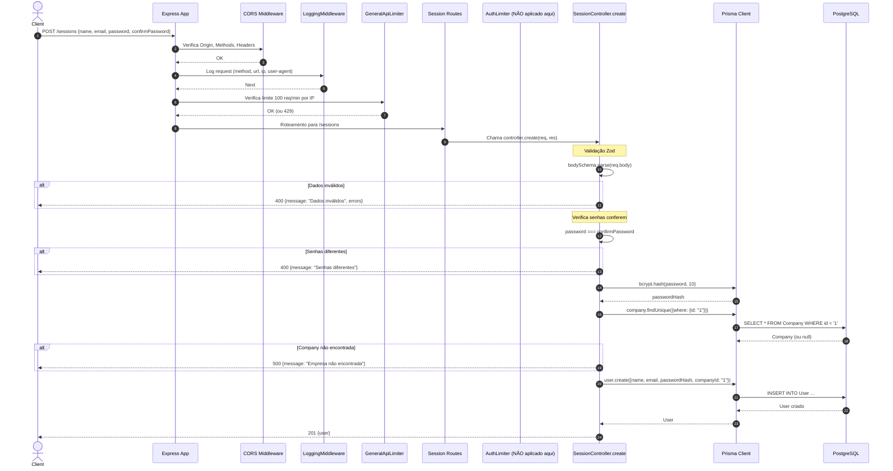

# Fluxo: Cadastro de Usuário (Legado) - POST /sessions

## Diagrama de Sequência

## Regras de Negócio

| Regra | Descrição | Código |
|-------|-----------|--------|
| **Validação de entrada** | Nome mínimo 3 chars, email válido, senha mínimo 6 chars | `z.object({name: z.string().min(3), email: z.email(), password: z.string().min(6)})` |
| **Confirmação de senha** | `password` deve ser igual a `confirmPassword` | `if (password !== confirmPassword)` |
| **Empresa padrão** | Usuário sempre vinculado à empresa com `id: "1"` (hardcoded) | `prisma.company.findUnique({where: {id: "1"}})` |
| **Hash de senha** | bcrypt com cost 10 | `bcrypt.hash(password, 10)` |
| **Erro Zod** | Retorna 400 com detalhes dos campos inválidos | `error instanceof z.ZodError` |
| **Rate Limit Global** | 100 requisições por minuto por IP (aplicado no app.ts) | `generalApiLimiter` |

## Middlewares Aplicados (Ordem)

1. **CORS** - Valida origin, methods, headers permitidos
2. **LoggingMiddleware** - Loga request (method, url, ip, user-agent, timestamp)
3. **GeneralApiLimiter** - 100 req/min por IP (keyGenerator: IP)
4. **Roteamento** - `/sessions` → SessionController.create

## Observações Importantes

⚠���⚠️ **DEPRECADO**: Este endpoint cria usuário na empresa hardcoded `id: "1"`. O fluxo correto de signup multi-tenant é `POST /companies/signup` que cria empresa + admin juntos.

⠀⚠️ **Sem autenticação**: Rota pública, não passa por `authMiddleware`.

⠀⚠️ **Sem rate limit específico**: Não usa `authLimiter` (apenas o global `generalApiLimiter`).