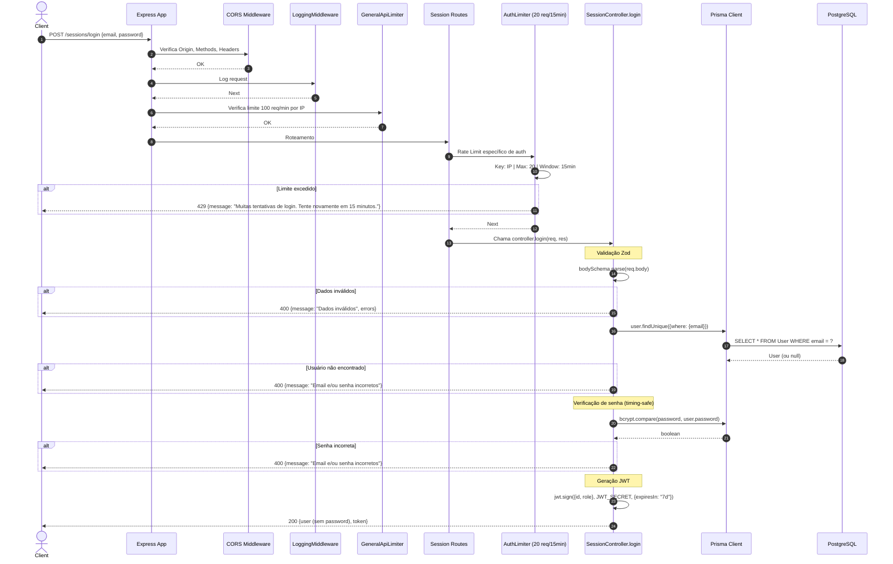

# Fluxo: Login - POST /sessions/login

## Diagrama de Sequência

## Regras de Negócio

| Regra | Descrição | Código |
|-------|-----------|--------|
| **Validação de entrada** | Email válido, senha mínimo 6 chars | `z.object({email: z.email(), password: z.string().min(6)})` |
| **Usuário existe** | Busca por email único | `prisma.user.findUnique({where: {email}})` |
| **Verificação de senha** | bcrypt.compare (timing-safe) | `bcrypt.compare(password, user.password)` |
| **Mensagem genérica** | Mesmo erro para email inexistente ou senha errada (anti-enumeração) | `"Email e/ou senha incorretos"` |
| **JWT Payload** | `{id: user.id, role: user.role}` - **NÃO inclui companyId, planTier, isMaster** | `jwt.sign({id, role}, ...)` |
| **Token Expiração** | 7 dias | `{expiresIn: "7d"}` |
| **Resposta** | Remove password do objeto user | `const {password: _, ...userWithoutPassword} = user` |

## Middlewares Aplicados (Ordem)

1. **CORS** - Valida origin
2. **LoggingMiddleware** - Log request
3. **GeneralApiLimiter** - 100 req/min por IP
4. **AuthLimiter** - **Rate limit específico: 20 req/15min por IP**
5. **Roteamento** → SessionController.login

## Observações Importantes

⚠️ **JWT INCOMPLETO**: O token gerado aqui **NÃO inclui** `companyId`, `planTier`, `isMaster`. Isso causa problemas no `AuthMiddleware` que espera esses campos. O fluxo correto de login multi-tenant deveria buscar a empresa do usuário e incluir no token.

⠀⚠️ **Rate Limit por IP**: Usa IP como chave (`req.ip ?? 'unknown'`), não por usuário (ainda não autenticado).

⚠️ **Anti-Timing Attack**: `bcrypt.compare` é timing-safe nativamente.

⚠️ **Sem verificação de status da empresa**: Não verifica se empresa está SUSPENDED, CANCELLED ou TRIAL_EXPIRED.