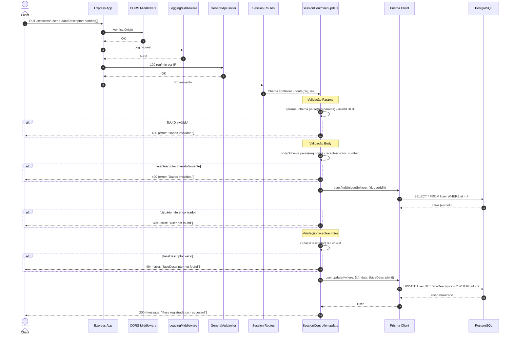

# Fluxo: Atualizar Face Descriptor - PUT /sessions/:userId

## Diagrama de Sequência

## Regras de Negócio

| Regra | Descrição | Código |
|-------|-----------|--------|
| **Validação UUID** | `userId` deve ser UUID válido | `z.uuid()` |
| **Face Descriptor Obrigatório** | Array de numbers obrigatório no body | `z.object({faceDescriptor: z.array(z.number())})` |
| **Usuário deve existir** | Busca por ID | `prisma.user.findUnique({where: {id: userId}})` |
| **Face Descriptor não vazio** | Verificação explícita `if (!faceDescriptor)` | `if (!faceDescriptor) return 404` |
| **Atualização Direta** | Sobrescreve `faceDescriptor` (Json field) | `prisma.user.update({data: {faceDescriptor}})` |

## Middlewares Aplicados (Ordem)

1. **CORS**
2. **LoggingMiddleware**
3. **GeneralApiLimiter** - 100 req/min por IP
4. **Roteamento** → SessionController.update

## Observações Importantes

⚠️ **SEM AUTENTICAÇÃO**: Rota **não passa por `authMiddleware`** - qualquer um com o userId pode atualizar o faceDescriptor de qualquer usuário.

⚠️ **SEM AUTORIZAÇÃO**: Não verifica se o usuário logado é o próprio usuário ou admin da empresa.

⚠️ **SEM RATE LIMIT ESPECÍFICO**: Apenas `generalApiLimiter` global.

⚠️ **SEM AUDITORIA**: Não usa `auditMiddleware` (não está nas rotas de session).

⚠️ **JWT INCOMPLETO**: Mesmo problema do login - não valida companyId.

## Riscos de Segurança

| Risco | Impacto | Mitigação Sugerida |
|-------|---------|-------------------|
| **Enumeration/Override** | Qualquer userId pode ter face alterada | Adicionar `authMiddleware` + verificação de ownership |
| **Face Spoofing** | Face descriptor pode ser injetado | Validar origem, adicionar challenge liveness |
| **Sem Auditoria** | Não há rastro de quem alterou | Adicionar `auditMiddleware` |