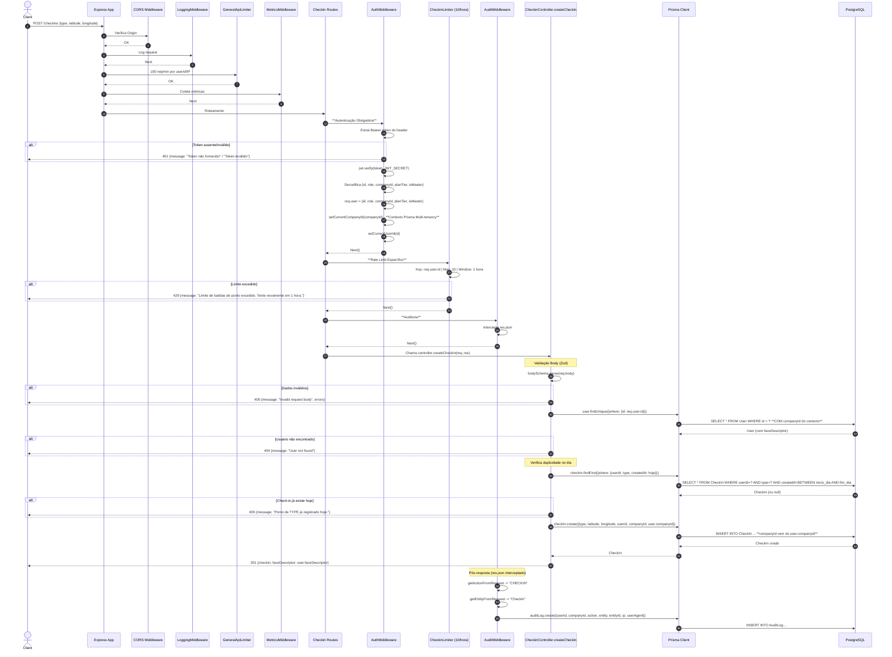

# Fluxo: Criar Check-in (Bater Ponto) - POST /checkins

## Diagrama de Sequência



## Regras de Negócio

| Regra | Descrição | Código |
|-------|-----------|--------|
| **Autenticação Obrigatória** | JWT válido com `companyId` | `authMiddleware` |
| **Validação Tipo** | ENUM: ENTRY, LUNCH_START, LUNCH_END, EXIT | `z.enum(["ENTRY", "LUNCH_START", "LUNCH_END", "EXIT"])` |
| **Coordenadas Obrigatórias** | latitude/longitude numbers | `z.number()` |
| **Um por dia por tipo** | Não pode registrar mesmo tipo duas vezes no dia | `checkIn.findFirst({userId, type, createdAt: hoje})` |
| **Empresa do Usuário** | `companyId` vem do `user.companyId` (contexto multi-tenancy) | `companyId: user.companyId` |
| **Face Descriptor** | Retorna no response para validação facial frontend | `faceDescriptor: user.faceDescriptor` |
| **Rate Limit** | 10 check-ins por hora por usuário | `checkinLimiter` (key: user.id) |
| **Auditoria** | Log automático em AuditLog | `auditMiddleware` intercepta res.json |

## Middlewares Aplicados (Ordem)

1. **CORS**
2. **LoggingMiddleware**
3. **GeneralApiLimiter** - 100 req/min
4. **MetricsMiddleware**
5. **AuthMiddleware** - **JWT verify + setCurrentCompanyId + setCurrentUserId**
6. **CheckinLimiter** - 10 req/hora por userId
7. **AuditMiddleware** - Intercepta response para log
8. **Controller** - CheckinController.createCheckin

## Contexto Multi-Tenancy (Crítico)

```
AuthMiddleware.setCurrentCompanyId(companyId)
    ↓
Prisma Extension ($allModels.$allOperations)
    ↓
Adiciona automaticamente `companyId` em:
  - WHERE clauses (findUnique, findMany, etc.)
  - DATA clauses (create, update, etc.)
```

Isso garante **isolamento total** - usuário da empresa A **nunca** vê dados da empresa B.

## Observações Importantes

✅ **Rate Limit por Usuário**: `keyGenerator: req.user?.id ?? req.ip` - mais seguro que IP.

✅ **Multi-Tenancy Automático**: Prisma Extension injeta `companyId` em todas as queries.

✅ **Auditoria Pós-operatório**: `AuditMiddleware` intercepta `res.json` para logar após sucesso (200/201).

⚠️ **Sem validação de plano**: Não verifica `PlanMiddleware` (trial expirado, limite funcionários).

⚠️ **Face Descriptor exposto**: Retorna no response - necessário para frontend validar, mas sensível.