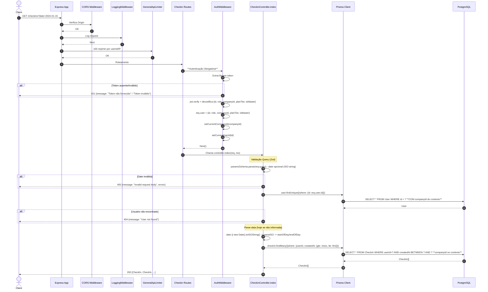

# Fluxo: Listar Check-ins do Usuário - GET /checkins

## Diagrama de Sequência

## Regras de Negócio

| Regra | Descrição | Código |
|-------|-----------|--------|
| **Autenticação Obrigatória** | JWT válido | `authMiddleware` |
| **Data Opcional** | Default: hoje (`new Date().toISOString()`) | `date: z.string().optional()` |
| **Parse de Data** | `parseISO` + `startOfDay`/`endOfDay` (date-fns) | `gte: startOfDay(parsedDate), lte: endOfDay(parsedDate)` |
| **Filtro por Usuário** | Apenas check-ins do usuário logado | `where: {userId: req.user.id}` |
| **Isolamento Multi-Tenancy** | Prisma Extension injeta `companyId` automaticamente | `setCurrentCompanyId(companyId)` no AuthMiddleware |
| **Ordenação** | Padrão do banco (createdAt ASC) - sem orderBy explícito | `findMany` sem orderBy |

## Middlewares Aplicados (Ordem)

1. **CORS**
2. **LoggingMiddleware**
3. **GeneralApiLimiter** - 100 req/min
4. **AuthMiddleware** - JWT verify + contexto multi-tenancy
5. **Controller** - CheckinController.index

## Observações Importantes

✅ **Rate Limit**: Usa `generalApiLimiter` (100 req/min), não tem limiter específico.

✅ **Sem Auditoria**: GET não é auditado (auditMiddleware só loga POST/PUT/DELETE com 200/201).

✅ **Isolamento Total**: `setCurrentCompanyId` + Prisma Extension garante que usuário só vê seus check-ins.

⚠️ **Sem Paginação**: Retorna todos os check-ins do dia - pode ser problema se muitos registros.

⚠️ **Sem Filtro por Tipo**: Não permite filtrar por tipo de check-in (ENTRY, EXIT, etc.).

## Diferenças do POST /checkins

| Aspecto | POST /checkins | GET /checkins |
|---------|----------------|---------------|
| **Rate Limit** | `checkinLimiter` (10/hora) | `generalApiLimiter` (100/min) |
| **Auditoria** | Sim (`auditMiddleware`) | Não |
| **Validação** | Body (type, lat, long) | Query (date opcional) |
| **Duplicidade** | Verifica se já existe | Não aplica |
| **Face Descriptor** | Retorna no response | Não retorna |