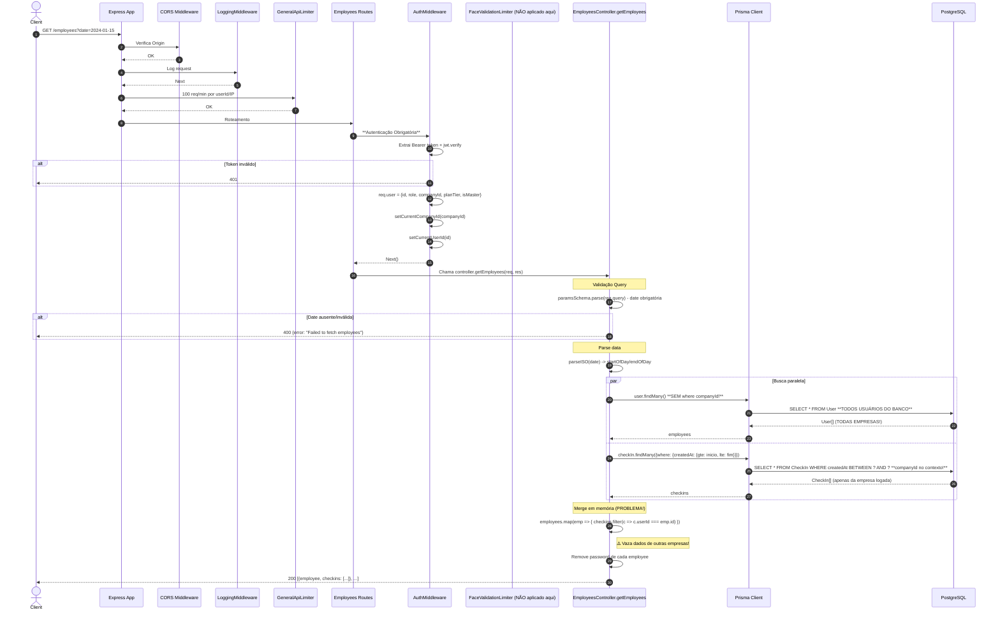

# Fluxo: Listar Funcionários com Check-ins do Dia - GET /employees

## Diagrama de Sequência



## Regras de Negócio

| Regra | Descrição | Código |
|-------|-----------|--------|
| **Autenticação Obrigatória** | JWT válido | `authMiddleware` |
| **Data Obrigatória** | Query param `date` string obrigatória | `z.object({date: z.string()})` |
| **Busca Funcionários** | `prisma.user.findMany()` **SEM FILTRO** | `prisma.user.findMany()` |
| **Busca Check-ins** | Com filtro de data **COM companyId do contexto** | `prisma.checkIn.findMany({where: {createdAt: {gte, lte}}})` |
| **Merge em Memória** | Loop manual para associar check-ins aos funcionários | `employees.map(emp => checkins.filter(c => c.userId === emp.id))` |
| **Remove Password** | Exclui campo password do response | `const {password, ...employeeWithoutPassword} = employee` |

## Middlewares Aplicados (Ordem)

1. **CORS**
2. **LoggingMiddleware**
3. **GeneralApiLimiter** - 100 req/min
4. **AuthMiddleware** - JWT + contexto multi-tenancy
5. **Controller** - EmployeesController.getEmployees

## ⚠️ PROBLEMAS CRÍTICOS DE SEGURANÇA

| Problema | Severidade | Impacto |
|----------|------------|---------|
| **Vazamento Cross-Tenant** | 🔴 CRÍTICO | `user.findMany()` sem `where: {companyId}` retorna **TODOS usuários de TODAS empresas** |
| **Merge Inseguro** | 🔴 CRÍTICO | Check-ins filtrados por companyId (contexto), mas funcionários não - associação incorreta |
| **Sem Rate Limit Específico** | 🟡 MÉDIO | Apenas `generalApiLimiter` |
| **Sem Paginação** | 🟡 MÉDIO | Retorna todos funcionários de todas empresas |
| **Sem Verificação de Role** | 🟡 MÉDIO | Qualquer role (EMPLOYEE) pode listar todos |

## Análise do Bug Multi-Tenancy

```typescript
// PROBLEMA: user.findMany() ignora o contexto multi-tenancy
const employees = await prisma.user.findMany()  // SEM where companyId

// CONTEXTO FUNCIONA PARA CHECK-INS (Prisma Extension injeta companyId)
const checkins = await prisma.checkIn.findMany({
    where: { createdAt: { gte: inicio, lte: fim } }  // companyId injetado automaticamente
})

// RESULTADO: Funcionários de TODAS empresas + Check-ins apenas da empresa logada
// Merge resulta em: funcionários sem check-ins (ou check-ins de outros usuários com mesmo ID)
```

## Correção Necessária

```typescript
// CORRETO: Filtrar por companyId do usuário logado
const companyId = req.user.companyId
const employees = await prisma.user.findMany({
    where: { companyId }  // ESSENCIAL
})
```