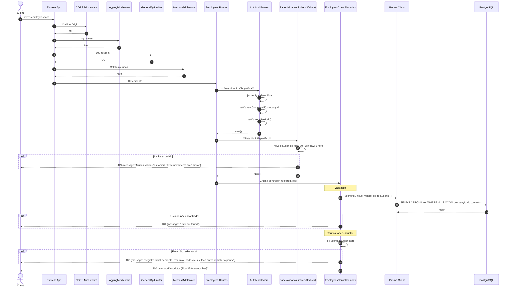

# Fluxo: Validação Facial (Buscar Face Descriptor) - GET /employees/face

## Diagrama de Sequência



## Regras de Negócio

| Regra | Descrição | Código |
|-------|-----------|--------|
| **Autenticação Obrigatória** | JWT válido | `authMiddleware` |
| **Rate Limit Específico** | 30 validações/hora por usuário | `faceValidationLimiter` (key: user.id) |
| **Usuário Deve Existir** | Busca por ID do token | `user.findUnique({where: {id: req.user.id}})` |
| **Face Descriptor Obrigatório** | Bloqueia check-in se não cadastrado | `if (!user.faceDescriptor) return 403` |
| **Mensagem Específica** | Orienta cadastrar face | "Registro facial pendente. Por favor, cadastre sua face antes de bater o ponto." |
| **Retorno Direto** | Retorna array de numbers (Float32Array serializado) | `res.json(user.faceDescriptor)` |

## Middlewares Aplicados (Ordem)

1. **CORS**
2. **LoggingMiddleware**
3. **GeneralApiLimiter** - 100 req/min
4. **MetricsMiddleware**
5. **AuthMiddleware** - JWT + contexto multi-tenancy
6. **FaceValidationLimiter** - **30 req/hora por userId**
7. **Controller** - EmployeesController.index

## Observações Importantes

✅ **Rate Limit por Usuário**: `keyGenerator: req.user?.id` - protege contra abuso de validação facial.

✅ **Bloqueio de Check-in**: Frontend deve chamar este endpoint ANTES de permitir bater ponto. Se 403, redireciona para cadastro facial.

✅ **Isolamento Multi-Tenancy**: `setCurrentCompanyId` garante que busca usuário apenas na empresa correta.

⚠️ **Sem Auditoria**: GET não é auditado pelo `auditMiddleware`.

⚠️ **Exposição Direta**: Retorna `faceDescriptor` raw (array de numbers) - dado biométrico sensível.

⚠️ **Validação Zod Ausente**: Não valida query params (não há), mas não trata erros de parse do ID.

## Fluxo Frontend Esperado

```
1. Usuário clica "Bater Ponto"
2. Frontend chama GET /employees.getFaceDescriptor()
   - Se 200: prossegue com liveness + verificação
   - Se 403: redireciona para /register-face
   - Se 429: aguarda / mostra erro rate limit
3. Liveness Challenge
4. Verificação facial (face-api.js)
5. POST /checkins se válido
```