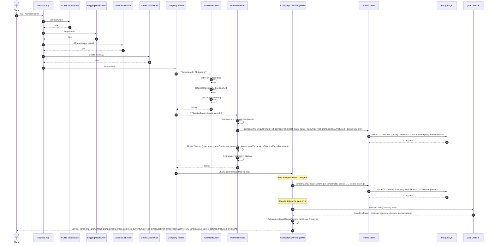

# Fluxo: Dados da Empresa Logada - GET /companies/me

## Diagrama de Sequência



## Regras de Negócio

| Regra | Descrição | Código |
|-------|-----------|--------|
| **Autenticação + Plano** | Requer authMiddleware + planMiddleware | `companyRoutes.use(authMiddleware).use(planMiddleware)` |
| **Empresa do Token** | `companyId` vem do `req.user.companyId` (JWT) | `req.user?.companyId` |
| **PlanMiddleware Injeta** | Busca empresa, calcula `currentEmployees`, `trialDaysRemaining`, `isTrial` | `planMiddleware` → `(req as any).planInfo` |
| **Busca Completa** | Inclui `_count: {users}` para contagem atual | `select: {_count: {select: {users: true}}}` |
| **Limites do Plano** | `getPlanLimits(plan)` retorna maxEmployees, price, api limits | `planLimits.ts` |
| **Cálculos Derivados** | `employeeUsagePercent`, `canCreateEmployee` | Controller calcula |
| **Retorna Configurações** | Inclui `settings` (logo, cores, timezone, etc.) | `settings: true` |

## Middlewares Aplicados (Ordem)

1. **CORS**
2. **LoggingMiddleware**
3. **GeneralApiLimiter** - 100 req/min
4. **MetricsMiddleware**
5. **AuthMiddleware** - JWT + contexto
6. **PlanMiddleware** - **Busca plano, valida status, injeta planInfo no request**
7. **Controller** - CompanyController.getMe

## PlanMiddleware - O que Verifica

```typescript
// planMiddleware FAZ:
1. Busca companyId do req.user
2. Query: company.findUnique({plan, status, maxEmployees, planExpiresAt, trialUsed, _count: {users}})
3. Calcula:
   - currentEmployees = _count.users
   - isTrial = status === TRIAL
   - trialDaysRemaining = isTrial ? dias até planExpiresAt : 0
   - trialExpired = isTrial && trialDaysRemaining <= 0
4. Injeta: (req as any).planInfo = {plan, status, maxEmployees, currentEmployees, planExpiresAt, isTrial, trialDaysRemaining}
```

## Observações Importantes

✅ **PlanMiddleware Obrigatório**: Todas rotas protegidas de company usam `companyRoutes.use(planMiddleware)`.

✅ **Dados Derivados**: Controller calcula `employeeUsagePercent` e `canCreateEmployee` baseado nos limites do plano.

✅ **Trial Info**: Retorna `trialDaysRemaining` para UI mostrar countdown.

⚠️ **Dupla Busca**: PlanMiddleware já buscou a empresa, Controller busca de novo (poderia otimizar passando no request).

⚠️ **Sem Rate Limit Específico**: Apenas global.

## Response Exemplo

```json
{
  "id": "uuid",
  "name": "Minha Empresa",
  "cnpj": "12.345.678/0001-90",
  "plan": "TIER_I",
  "status": "TRIAL",
  "planExpiresAt": "2024-02-15T00:00:00.000Z",
  "maxEmployees": 10,
  "currentEmployees": 3,
  "employeeLimit": 10,
  "employeeUsagePercent": 30,
  "canCreateEmployee": true,
  "settings": {"primaryColor": "#10b981", "timezone": "America/Sao_Paulo"},
  "trialUsed": true,
  "createdAt": "2024-01-15T10:30:00.000Z"
}
```
