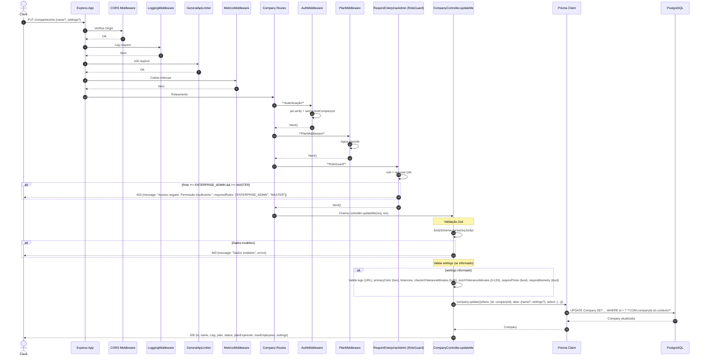

# Fluxo: Atualizar Empresa - PUT /companies/me

## Diagrama de Sequência



## Regras de Negócio

| Regra | Descrição | Código |
|-------|-----------|--------|
| **Autenticação + Plano** | authMiddleware + planMiddleware | `companyRoutes.use(authMiddleware).use(planMiddleware)` |
| **Role ENTERPRISE_ADMIN** | Apenas admin da empresa (ou MASTER) | `requireEnterpriseAdmin` (RoleGuard) |
| **Validação Parcial** | Todos campos opcionais | `z.object({name: z.string().min(2).optional(), settings: z.object({...}).optional()})` |
| **Settings Validação** | Logo: URL; primaryColor: hex #RRGGBB; tolerâncias: números com range; booleans | `z.object({logo: z.string().url().nullable(), primaryColor: z.string().regex(/^#[0-9A-Fa-f]{6}$/), checkinToleranceMinutes: z.number().min(0).max(60), ...})` |
| **Merge Settings** | Spread: `{...settingsAtuais, ...settingsNovos}` | `data: {settings: {...(settings as object)}}` |
| **Isolamento** | Atualiza apenas empresa do token | `where: {id: req.user.companyId}` |

## Middlewares Aplicados (Ordem)

1. **CORS**
2. **LoggingMiddleware**
3. **GeneralApiLimiter**
4. **MetricsMiddleware**
5. **AuthMiddleware**
6. **PlanMiddleware**
7. **RequireEnterpriseAdmin** - **RoleGuard: role === ENTERPRISE_ADMIN || MASTER**
8. **Controller** - CompanyController.updateMe

## RoleGuard - RequireEnterpriseAdmin

```typescript
export const requireEnterpriseAdmin = requireRole(UserRole.ENTERPRISE_ADMIN, UserRole.MASTER)

function requireRole(...allowedRoles) {
  return (req, res, next) => {
    const userRole = req.user?.role as UserRole
    if (!userRole) return 401
    if (!allowedRoles.includes(userRole)) return 403
    next()
  }
}
```

- **ENTERPRISE_ADMIN**: Admin da própria empresa
- **MASTER**: Super admin (você) - pode gerenciar qualquer empresa

## Observações Importantes

✅ **Proteção de Role**: Impede que EMPLOYEE altere configurações da empresa.

✅ **Validação Estrita de Settings**: Regex para cor hex, ranges para tolerâncias, URL para logo.

✅ **Merge Seguro**: Spread preserva settings existentes, sobrescreve apenas informados.

⚠️ **Sem Auditoria**: PUT não usa `auditMiddleware` (apenas checkins POST).

⚠️ **Sem Verificação de Plano**: Não bloqueia se trial expirado (planMiddleware não tem `requireActivePlan` automático).

## Settings Permitidos

```json
{
  "logo": "https://exemplo.com/logo.png",
  "primaryColor": "#10b981",
  "timezone": "America/Sao_Paulo",
  "checkinToleranceMinutes": 15,
  "lunchToleranceMinutes": 60,
  "requirePhoto": true,
  "requireBiometry": false
}
```
