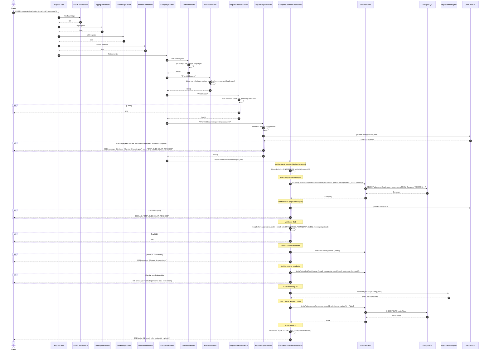

# Fluxo: Criar Convite Funcionário - POST /companies/me/invites

## Diagrama de Sequência



## Regras de Negócio

| Regra | Descrição | Código |
|-------|-----------|--------|
| **Autenticação + Plano** | authMiddleware + planMiddleware | `companyRoutes.use(authMiddleware).use(planMiddleware)` |
| **Role ENTERPRISE_ADMIN** | Apenas admin da empresa | `requireEnterpriseAdmin` |
| **Limite Funcionários** | Bloqueia se `currentEmployees >= maxEmployees` do plano | `requireEmployeeLimit` middleware + verificação no controller |
| **Validação Email/Role** | Email válido, role: ENTERPRISE_ADMIN ou EMPLOYEE (default) | `z.object({email: z.email(), role: z.enum([...]).default('EMPLOYEE')})` |
| **Usuário Não Existe** | Bloqueia se email já cadastrado no sistema | `user.findUnique({where: {email}})` |
| **Convite Único** | Bloqueia se já existe convite pendente (não usado, não expirado) | `inviteToken.findFirst({email, companyId, usedAt: null, expiresAt: {gt: now}})` |
| **Token Seguro** | `crypto.randomBytes(32).toString('hex')` - 64 chars hex | `crypto.randomBytes(32).toString('hex')` |
| **Expiração** | 7 dias (`addDays(new Date(), 7)`) | `expiresAt: addDays(new Date(), 7)` |
| **Invite URL** | Frontend URL + token para página de aceite | `${FRONTEND_URL}/accept-invite/${token}` |

## Middlewares Aplicados (Ordem)

1. **CORS**
2. **LoggingMiddleware**
3. **GeneralApiLimiter**
4. **MetricsMiddleware**
5. **AuthMiddleware**
6. **PlanMiddleware** - injeta planInfo
6. **RequireEnterpriseAdmin** - RoleGuard
7. **RequireEmployeeLimit** - EmployeeLimit** - **PlanMiddleware.requireEmployeeLimit** (verifica limite ANTES do controller)
8. **Controller** - CompanyController.createInvite

## Dupla Verificação de Limite

```typescript
// 1. MIDDLEWARE (antes do controller)
export function requireEmployeeLimit(req, res, next) {
  const planInfo = (req as any).planInfo
  const limits = getPlanLimits(planInfo.plan)
  if (limits.maxEmployees !== null && planInfo.currentEmployees >= limits.maxEmployees) {
    return res.status(403).json({code: 'EMPLOYEE_LIMIT_REACHED'})
  }
  next()
}

// 2. CONTROLLER (dupla checagem)
const company = await prisma.company.findUnique({...})
const limits = getPlanLimits(company.plan)
if (limits.maxEmployees !== null && company._count.users >= limits.maxEmployees) {
  return res.status(403).json({code: 'EMPLOYEE_LIMIT_REACHED'})
}
```

## Observações Importantes

✅ **Proteção em Camadas**: Middleware + Controller = defesa em profundidade.

✅ **Token Criptograficamente Seguro**: `crypto.randomBytes(32)` = 256 bits entropy.

✅ **Expiração Curta**: 7 dias força ação rápida.

✅ **Convite Único**: Impede spam de convites para mesmo email.

✅ **Invite URL Pronta**: Frontend só precisa abrir o link.

⚠️ **Sem Rate Limit Específico**: Apenas global.

⚠️ **Mensagem Customizada**: Campo `message` opcional no body mas não usado no email (futuro).

## Response Exemplo

```json
{
  "invite": {
    "id": "uuid",
    "email": "joao@empresa.com",
    "role": "EMPLOYEE",
    "expiresAt": "2024-01-22T10:30:00.000Z",
    "inviteUrl": "https://viggo.com/accept-invite/a1b2c3d4e5f6..."
  }
}
```
