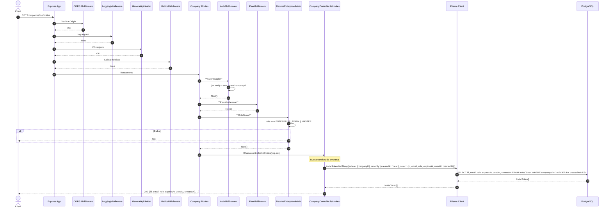
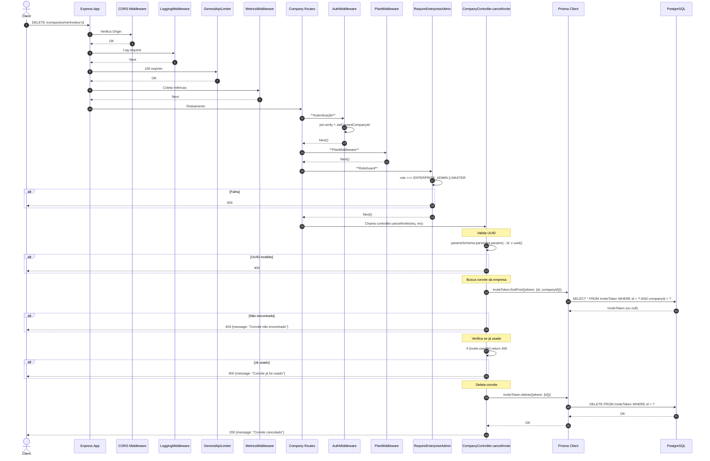

# Fluxo: Listar e Cancelar Convites - GET/DELETE /companies/me/invites

## Diagrama de Sequência - LISTAR (GET /companies/me/invites)



## Diagrama de Sequência - CANCELAR (DELETE /companies/me/invites/:id)



## Regras de Negócio (Listar)

| Regra | Descrição | Código |
|-------|-----------|--------|
| **Autenticação + Role** | auth + plan + requireEnterpriseAdmin | Middlewares em cadeia |
| **Filtro por Empresa** | Apenas convites da empresa logada | `where: {companyId}` |
| **Ordenação** | Mais recentes primeiro | `orderBy: {createdAt: 'desc'}` |
| **Campos Retornados** | id, email, role, expiresAt, usedAt, createdAt | `select: {...}` |

## Regras de Negócio (Cancelar)

| Regra | Descrição | Código |
|-------|-----------|--------|
| **Validação UUID** | `id` deve ser UUID válido | `z.uuid()` |
| **Pertence à Empresa** | `where: {id, companyId}` - impede acesso cross-tenant | `findFirst({where: {id, companyId}})` |
| **Não Usado** | Só cancela se `usedAt === null` | `if (invite.usedAt) return 400` |
| **Soft Delete** | Hard delete (DELETE) - convite cancelado desaparece | `inviteToken.delete({where: {id}})` |

## Middlewares Aplicados (Ordem)

1. **CORS**
2. **LoggingMiddleware**
3. **GeneralApiLimiter**
4. **MetricsMiddleware**
5. **AuthMiddleware**
6. **PlanMiddleware**
7. **RequireEnterpriseAdmin**
8. **Controller** - listInvites / cancelInvite

## Observações Importantes

✅ **Isolamento Total**: `where: {id, companyId}` impede que admin de empresa A cancele convite de empresa B.

✅ **Apenas Pendentes**: Não permite cancelar convite já usado (`usedAt !== null`).

✅ **Ordenação Útil**: Mais recentes primeiro facilita gestão.

⚠️ **Hard Delete**: Convite cancelado é removido permanentemente (não soft delete).

⚠️ **Sem Auditoria**: DELETE não é auditado (auditMiddleware só pega checkins).

## Response Exemplo (Listar)

```json
[
  {
    "id": "uuid-1",
    "email": "joao@empresa.com",
    "role": "EMPLOYEE",
    "expiresAt": "2024-01-22T10:30:00.000Z",
    "usedAt": null,
    "createdAt": "2024-01-15T10:30:00.000Z"
  },
  {
    "id": "uuid-2",
    "email": "maria@empresa.com",
    "role": "ENTERPRISE_ADMIN",
    "expiresAt": "2024-01-20T15:00:00.000Z",
    "usedAt": "2024-01-18T09:15:00.000Z",
    "createdAt": "2024-01-13T14:20:00.000Z"
  }
]
```
