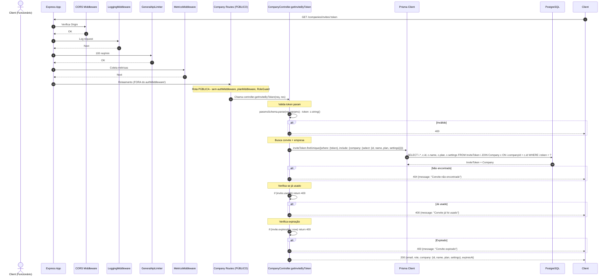
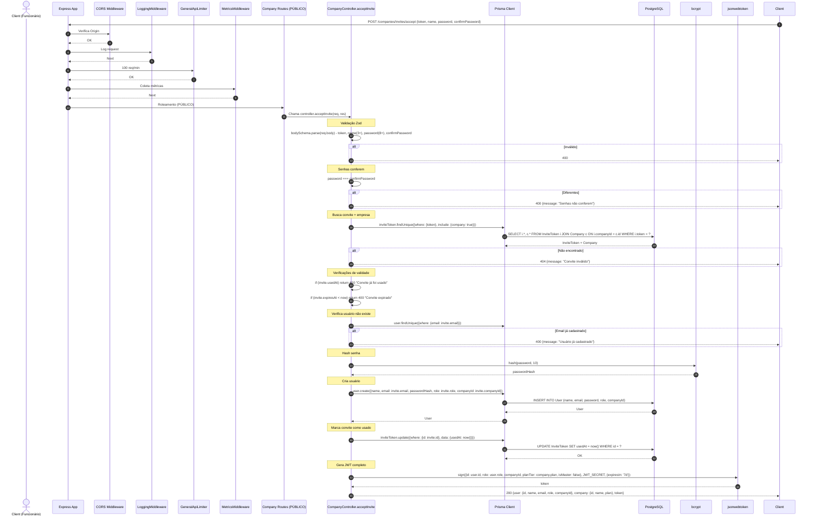

# Fluxo: Convite Público - GET /companies/invites/:token e POST /companies/invites/accept

## Diagrama de Sequência - VALIDAR TOKEN (GET /companies/invites/:token)

## Diagrama de Sequência - ACEITAR CONVITE (POST /companies/invites/accept)

## Regras de Negócio (Validar Token)

| Regra | Descrição | Código |
|-------|-----------|--------|
| **Rota Pública** | Sem autenticação, sem planMiddleware, sem RoleGuard | Rota registrada ANTES de `companyRoutes.use(authMiddleware)` |
| **Busca com Include** | Busca convite + dados da empresa (name, plan, settings) | `include: {company: {select: {id, name, plan, settings}}}` |
| **Validações** | Existe, não usado, não expirado | `if (invite.usedAt) / if (invite.expiresAt < now)` |
| **Retorno** | Email, role, empresa (para UI mostrar info), expiresAt | `{email, role, company, expiresAt}` |

## Regras de Negócio (Aceitar Convite)

| Regra | Descrição | Código |
|-------|-----------|--------|
| **Rota Pública** | Sem autenticação | Fora do `use(authMiddleware)` |
| **Validação Completa** | Token, name(3+), password(8+), confirmPassword | `z.object({token: z.string(), name: z.string().min(3), password: z.string().min(8), confirmPassword: z.string()})` |
| **Senhas Conferem** | password === confirmPassword | `if (password !== confirmPassword)` |
| **Convite Válido** | Existe, não usado, não expirado | Mesmas verificações do GET |
| **Usuário Não Existe** | Email do convite não pode já ter conta | `user.findUnique({where: {email: invite.email}})` |
| **Cria Usuário** | Role = invite.role (ENTERPRISE_ADMIN ou EMPLOYEE) | `role: invite.role` |
| **Marca Usado** | `usedAt = now()` impede reuso | `inviteToken.update({data: {usedAt: new Date()}})` |
| **JWT Completo** | Inclui companyId, planTier, isMaster | `jwt.sign({id, role, companyId, planTier: company.plan, isMaster: false})` |
| **Login Automático** | Retorna token para login imediato | `return res.json({user, company, token})` |

## Middlewares Aplicados

**NENHUM** (Rotas Públicas)
- Registradas ANTES de `companyRoutes.use(authMiddleware)`
- Apenas: CORS, LoggingMiddleware, GeneralApiLimiter, MetricsMiddleware (do app.ts)

## Observações Importantes

✅ **Rotas Públicas Essenciais**: Permitem fluxo de aceite sem login prévio.

✅ **Validações Rigorosas**: Token válido, não usado, não expirado, email único.

✅ **Login Automático**: Retorna JWT para redirecionar direto ao dashboard.

✅ **Marca Usado Atomicamente**: `usedAt` impede reuso do mesmo token.

⚠️ **Sem Rate Limit Específico**: Vulnerável a brute force de tokens.

⚠️ **Senha Mínimo 8 chars**: Mais forte que login legacy.

##
