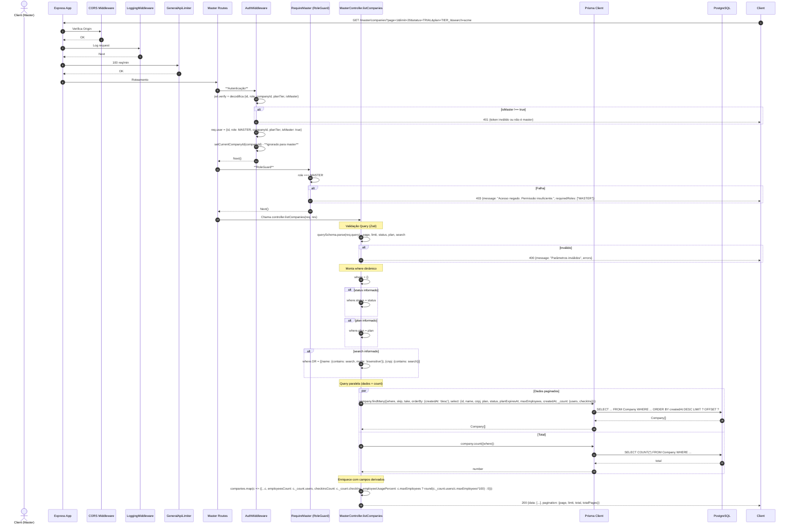

# Fluxo: Master - Listar Empresas - GET /master/companies

## Diagrama de Sequência



## Regras de Negócio

| Regra | Descrição | Código |
|-------|-----------|--------|
| **Apenas MASTER** | `requireMaster` garante role === MASTER | `requireMaster = requireRole(UserRole.MASTER)` |
| **Filtros** | status (TRIAL/ACTIVE/SUSPENDED/CANCELLED), plan (TIER_I/II/III/CUSTOM), search (name/cnpj) | `querySchema` com enums |
| **Busca Insensível** | `mode: 'insensitive'` no name | `name: {contains: search, mode: 'insensitive'}` |
| **Paginação** | page (default 1), limit (default 20, max 100) | `skip: (page-1)*limit, take: limit` |
| **Ordenação** | Mais recentes primeiro | `orderBy: {createdAt: 'desc'}` |
| **Contadores** | `_count: {users, checkIns}` para employeesCount, checkinsCount | `select: {_count: {select: {users: true, checkIns: true}}}` |
| **Campos Derivados** | employeeUsagePercent = round(users/maxEmployees*100) | Controller calcula |
| **Paginação Response** | page, limit, total, totalPages | `Math.ceil(total/limit)` |

## Middlewares Aplicados (Ordem)

1. **CORS**
2. **LoggingMiddleware**
3. **GeneralApiLimiter**
4. **AuthMiddleware** - **Verifica isMaster no JWT**
5. **RequireMaster** - **RoleGuard: role === MASTER**
6. **Controller** - MasterController.listCompanies

## RoleGuard - RequireMaster

```typescript
export const requireMaster = requireRole(UserRole.MASTER)

function requireRole(...allowedRoles) {
  return (req, res, next) => {
    const userRole = req.user?.role as UserRole
    if (!userRole) return 401
    if (!allowedRoles.includes(userRole)) return 403
    next()
  }
}
```

- **Apenas MASTER**: O token deve ter `isMaster: true` e `role: "MASTER"`.

## Observações Importantes

✅ **Acesso Global**: MASTER vê TODAS empresas (sem filtro de companyId).

✅ **Filtros Poderosos**: Status, plano, busca textual.

✅ **Paginação Completa**: Controle total de paginação.

✅ **Métricas Enriquecidas**: employeesCount, checkinsCount, usage percent.

⚠️ **Sem Rate Limit Específico**: Apenas global.

⚠️ **Dados Sensíveis**: Retorna CNPJ, planExpiresAt - apenas para MASTER.

## Response Exemplo

```json
{
  "data": [
    {
      "id": "uuid",
      "name": "Acme Ltda",
      "cnpj": "12.345.678/0001-90",
      "plan": "TIER_I",
      "status": "TRIAL",
      "planExpiresAt": "2024-02-15T00:00:00.000Z",
      "maxEmployees": 10,
      "createdAt": "2024-01-15T10:30:00.000Z",
      "employeesCount": 3,
      "checkinsCount": 45,
      "employeeUsagePercent": 30
    }
  ],
  "pagination": {
    "page": 1,
    "limit": 20,
    "total": 47,
    "totalPages": 3
  }
}
```
