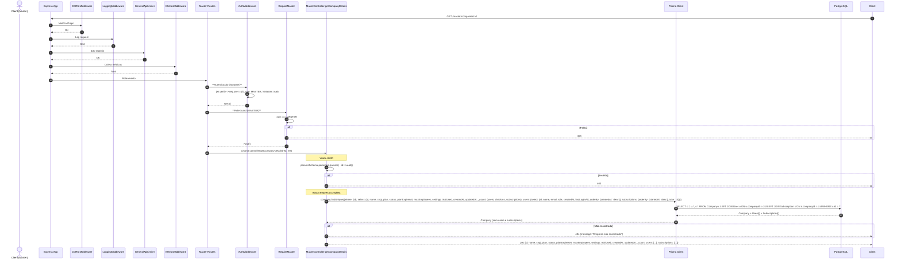

# Fluxo: Master - Detalhes da Empresa - GET /master/companies/:id

## Diagrama de Sequência



## Regras de Negócio

| Regra | Descrição | Código |
|-------|-----------|--------|
| **Apenas MASTER** | requireMaster | `requireMaster` |
| **Validação UUID** | `id` deve ser UUID válido | `z.uuid()` |
| **Busca Completa** | Empresa + usuários + subscriptions (últimas 10) | `select: {_count: {users, checkIns, subscriptions}, users: {...}, subscriptions: {...}}` |
| **Usuários Ordenados** | Mais recentes primeiro | `orderBy: {createdAt: 'desc'}` |
| **Subscriptions Limitadas** | Últimas 10 por data | `take: 10, orderBy: {startedAt: 'desc'}` |
| **Acesso Global** | MASTER acessa qualquer empresa (sem filtro companyId) | Sem `where: {companyId}` |

## Middlewares Aplicados (Ordem)

1. **CORS**
2. **LoggingMiddleware**
3. **GeneralApiLimiter**
4. **MetricsMiddleware**
5. **AuthMiddleware** - verifica isMaster
6. **RequireMaster** - RoleGuard
7. **Controller** - MasterController.getCompanyDetails

## Observações Importantes

✅ **Visão 360°**: MASTER vê tudo - usuários, subscriptions, settings, contadores.

✅ **Histórico de Planos**: Subscriptions mostram histórico de mudanças de plano.

✅ **Último Login**: `lastLoginAt` dos usuários para monitoramento.

✅ **Sem Filtro Tenant**: MASTER ignora multi-tenancy (acesso total).

⚠️ **Dados Sensíveis**: Retorna CNPJ, settings, emails - apenas MASTER.

⚠️ **Sem Paginação Users**: Retorna todos usuários da empresa (pode ser muito se empresa grande).

## Response Exemplo

```json
{
  "id": "uuid",
  "name": "Acme Ltda",
  "cnpj": "12.345.678/0001-90",
  "plan": "TIER_I",
  "status": "TRIAL",
  "planExpiresAt": "2024-02-15T00:00:00.000Z",
  "maxEmployees": 10,
  "settings": {"primaryColor": "#10b981"},
  "trialUsed": true,
  "createdAt": "2024-01-15T10:30:00.000Z",
  "updatedAt": "2024-01-20T14:20:00.000Z",
  "_count": {"users": 3, "checkIns": 45, "subscriptions": 1},
  "users": [
    {"id": "uuid", "name": "João Admin", "email": "joao@acme.com", "role": "ENTERPRISE_ADMIN", "createdAt": "...", "lastLoginAt": "..."},
    {"id": "...", "name": "Maria", "email": "maria@acme.com", "role": "EMPLOYEE", "createdAt": "...", "lastLoginAt": null}
  ],
  "subscriptions": [
    {"id": "...", "planTier": "TIER_I", "price": 0, "status": "TRIAL", "startedAt": "...", "expiresAt": "..."}
  ]
}
```
