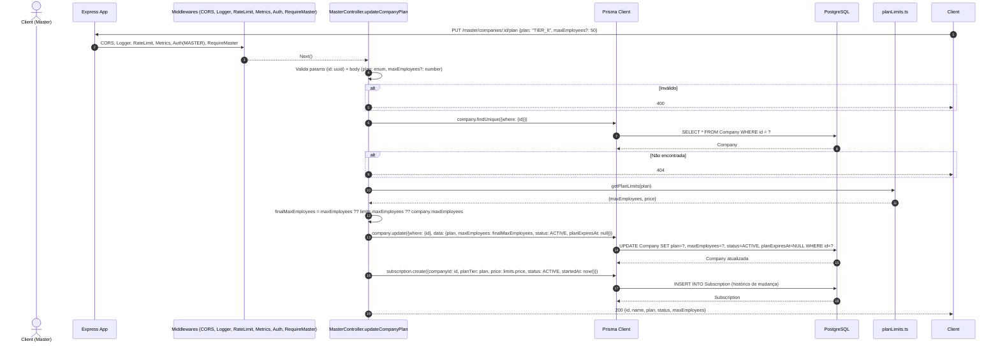
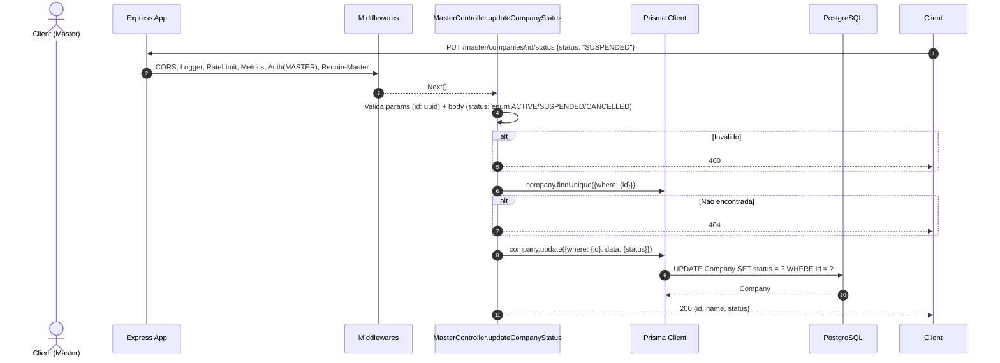
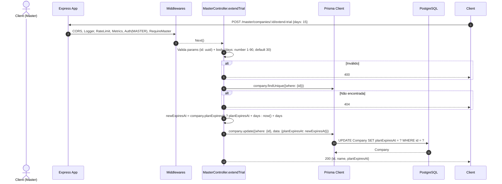

# Fluxos Master: Override Plano, Status e Estender Trial

---

## 1. Override Plano - PUT /master/companies/:id/plan

### Diagrama de Sequência

### Regras de Negócio

| Regra | Descrição |
|-------|-----------|
| **Apenas MASTER** | requireMaster |
| **Validação** | plan: enum TIER_I/II/III/ENTERPRISE_CUSTOM; maxEmployees opcional (min 1) |
| **Empresa Existe** | findUnique |
| **Limites do Plano** | getPlanLimits(plan) retorna maxEmployees e price padrão |
| **MaxEmployees Final** | body.maxEmployees ?? limits.maxEmployees ?? company.maxEmployees (fallback) |
| **Ativação Automática** | status = ACTIVE, planExpiresAt = null (remove trial) |
| **Histórico** | Cria Subscription com novo plano, price, status ACTIVE |
| **Override Total** | MASTER pode colocar qualquer plano/limite |

---

## 2. Override Status - PUT /master/companies/:id/status

### Diagrama de Sequência

### Regras de Negócio

| Regra | Descrição |
|-------|-----------|
| **Apenas MASTER** | requireMaster |
| **Status Válidos** | ACTIVE, SUSPENDED, CANCELLED (TRIAL não permitido - use extend-trial) |
| **Efeito SUSPENDED** | PlanMiddleware.requireActivePlan bloqueia check-ins |
| **Efeito CANCELLED** | PlanMiddleware.requireActivePlan bloqueia tudo |
| **Sem Histórico** | Não cria Subscription (apenas override plano cria) |

---

## 3. Estender Trial - POST /master/companies/:id/extend-trial

### Diagrama de Sequência

### Regras de Negócio

| Regra | Descrição |
|-------|-----------|
| **Apenas MASTER** | requireMaster |
| **Dias** | 1-90 (default 30) |
| **Cálculo** | Se tem planExpiresAt: soma dias; senão: now() + dias |
| **Não Altera Status** | Mantém status atual (TRIAL/ACTIVE/etc) |
| **Não Altera Plano** | Mantém plan e maxEmployees atuais |
| **Uso Comum** | Dar mais tempo para testes, cortesia, recuperação |

---

## Middlewares Comuns (Todos)

1. **CORS**
2. **LoggingMiddleware**
3. **GeneralApiLimiter** (100 req/min)
4. **MetricsMiddleware**
5. **AuthMiddleware** (verifica isMaster)
6. **RequireMaster** (RoleGuard)
7. **Controller**

## Observações Importantes

✅ **Poder Total**: MASTER pode fazer override de qualquer regra de negócio.

✅ **Auditoria Implícita**: Mudanças de plano criam Subscription (histórico).

✅ **Flexibilidade**: Útil para suporte, cortesia, recuperação de contas.

⚠️ **Poder Perigoso**: MASTER pode burlar limites, criar planos customizados.

⚠️ **Sem Auditoria Explícita**: Não usa auditMiddleware (pode adicionar).

⚠️ **Sem Notificação**: Não avisa empresa da mudança (email/push futuro).
